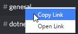

Channel
===============

If you have any problems with this guide, please contact @Thefjong in `Discord API Chat`_ in the Discord4J channel.

Getting a channel by ID
-------------------------

First of all you might be wondering how to get the id from a channel. Do following:

Afterwards, put the link in notepad or something. Then copy the id out of it, like I do here:

Now we want to use it in our ultra amazing bot. 

.. code-block:: java
	
    public IChannel changeBotAvatar(IDiscordClient client, String id)
    {
        return client.getChannelByID(id);
    }

That was quite easy.

Getting Messages in a channel
------------------------------

.. code-block:: java

	public MessageList getMessages(IDiscordClient client, String ChannelID)
    {
        return client.getChannelByID(ChannelID).getMessages();
    }

Toggling Typing Status
-----------------------

.. code-block:: java 

	public void toggleTypingStatus(IDiscordClient client, String ChannelID)
    {
        client.getChannelByID(ChannelID).toggleTypingStatus();
    }

Changing Channel Name, Position & Topic
----------------------------------------

.. code-block:: java

    public void changeChannel(IDiscordClient client, String ChannelID)
    {
        client.getChannelByID(ChannelID).changeName("Bot chat");
        client.getChannelByID(ChannelID).changePosition(0);
        client.getChannelByID(ChannelID).changeTopic("Bot chat, only for Awesome bots...");
    }

Sending files and messages
---------------------------

.. code-block:: java

    public void SendFileAndMessage(IDiscordClient client, String ChannelID)
    {
        client.getChannelByID(ChannelID).sendFile(new File("filetosend"));
        client.getChannelByID(ChannelID).sendMessage("Heyo Everyone.. wut");
    }

There's lots of methods more... These are just some examples. see `Javadocs`_ for more. 

.. _Discord API Chat: https://discord.gg/0SBTUU1wZTX5pYo1
.. _JavaDocs: http://austinv11.github.io/Discord4J/docs.html

